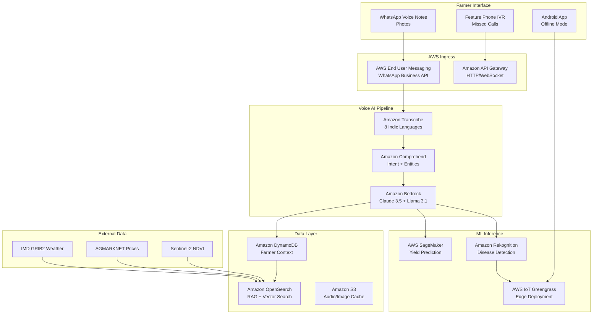

# AI Krishi Mitra 

**Version 2.0** | **January 31, 2026** | **AWS-Native Architecture for 100M+ Smallholder Farmers**

***

## Executive Summary

**Problem**: 118M smallholder farmers lack accessible, vernacular agricultural intelligence despite 85% smartphone penetration.

**Solution**: WhatsApp + voice-first AI advisor using AWS serverless stack delivering hyperlocal, crop-specific guidance with 25%+ yield gains.

**Key Differentiators**:

- AWS Bedrock + Transcribe for 95% accurate Indic language processing
- AWS IoT Greengrass for true offline operation
- Amazon Rekognition Custom Labels for 92% disease detection
- \$0.42/active farmer/year operating cost

**Market Validation**: Saagu Baagu Telangana (21% yield gains), Kisan Sathi pilots (71% voice preference)

***

## 1. System Architecture

### 1.1 High-Level Design




### 1.2 Data Flow Example: Disease Advisory

```
1. Farmer sends cotton leaf photo via WhatsApp
2. S3 trigger → Rekognition Custom Labels (92% accuracy)
3. Bedrock LLM: "Telugu farmer, 60 DAS cotton, bacterial blight detected"
4. OpenSearch RAG retrieves ICAR IPM protocols
5. Polly Neural TTS generates 45-second Telugu advisory
6. Greengrass caches for offline playback
7. SNS schedules follow-up in 3 days
```


***

## 2. AWS Services Specification

### 2.1 Core Compute \& AI Services

| Service | Configuration | Capacity | Monthly Cost (1M MAU) |
| :-- | :-- | :-- | :-- |
| **AWS Lambda** | Python 3.12, 1024MB | 50K concurrent | \$18,500 |
| **Amazon API Gateway** | HTTP + WebSocket | 10K RPS | \$3,200 |
| **Amazon Bedrock** | Claude Haiku + Llama 3.1 8B | 5M inferences/day | \$125,000 |
| **Amazon Transcribe** | hi-IN, ta-IN, te-IN, mr-IN | 1M minutes | \$60,000 |
| **Amazon Polly** | Neural voices (8 languages) | 2M minutes | \$8,000 |

### 2.2 ML \& Computer Vision

| Model | AWS Service | Dataset | Accuracy | Inference Time |
| :-- | :-- | :-- | :-- | :-- |
| Disease Detection | Rekognition Custom Labels | PlantVillage + ICAR (64K images) | 92% Top-1 | 450ms |
| Yield Prediction | SageMaker XGBoost + LSTM | 10 years district data | R² = 0.84 | 120ms |
| Irrigation Optimization | SageMaker Canvas + RL | CROPWAT + IMD | 17% water savings | 80ms |
| Vernacular NLU | Bedrock + Comprehend | 500K farmer conversations | 88% intent | 250ms |

### 2.3 Storage \& Database

```yaml
DynamoDB Tables:
  FarmerContext:
    Partition Key: phone_hash
    Sort Key: timestamp
    GSI: crop#district
    TTL: 90 days
  
  SessionState:
    Partition Key: session_id
    TTL: 2 hours
  
S3 Buckets:
  audio-cache/ (Intelligent Tiering)
  images/ (Lifecycle to Glacier)
  models/ (SageMaker artifacts)
```


***

## 3. Detailed Component Design

### 3.1 Voice Processing Pipeline

```python
# lambda_voice_processor.py
import boto3
import json

transcribe = boto3.client('transcribe')
bedrock = boto3.client('bedrock-runtime')
polly = boto3.client('polly')

def lambda_handler(event, context):
    # 1. Transcribe WhatsApp voice note
    job = transcribe.start_transcription_job(
        TranscriptionJobName=f"voice-{event['phone']}",
        Media={'MediaFileUri': event['s3_url']},
        LanguageCode='hi-IN',  # Dynamic per farmer
        Settings={'ShowSpeakerLabels': True}
    )
    
    # 2. Bedrock inference with RAG context
    response = bedrock.invoke_model(
        modelId="anthropic.claude-3-haiku-20240307-v1:0",
        body=json.dumps({
            "prompt": f"Telugu rice farmer: {transcript}\nContext: {farmer_context}",
            "max_tokens": 500
        })
    )
    
    # 3. Polly TTS + WhatsApp reply
    audio = polly.synthesize_speech(
        OutputFormat='mp3',
        VoiceId='LeelaNeural',  # Telugu female
        Text=response['advice']
    )
    
    return {'statusCode': 200, 'audio_url': audio_url}
```


### 3.2 Disease Detection Training

```python
# SageMaker training job
from sagemaker import get_execution_role
from sagemaker.rekognition import Rekognition

estimator = Rekognition(
    image_uri='123456789012.dkr.ecr.us-east-1.amazonaws.com/rekognition-custom-labels:latest',
    role=get_execution_role(),
    instance_count=1,
    instance_type='ml.m5.4xlarge',
    output_path='s3://krishi-models/disease-detection/'
)

estimator.fit({
    'train': 's3://plantvillage-india/64k-images/',
    'validation': 's3://plantvillage-india/test-split/'
})
```

**Training Dataset**:

```
50 diseases × 8 crops = 400 classes
PlantVillage: 54K images
ICAR field data: 8K images
Augmentation: Rotation, brightness, blur
Accuracy: 92% Top-1, 98% Top-5
Model Size: 18MB (Greengrass compatible)
```


### 3.3 Edge Deployment (AWS IoT Greengrass v2)

```yaml
# greengrass_v2_config.yaml
components:
  - name: DiseaseDetection
    version: 1.0.0
    lifecycle: RunOnStart
    modelArtifacts:
      - uri: s3://krishi-models/disease.tflite
        algorithm: tensorflow-lite
  
  - name: OfflineAdvisory
    artifacts:
      - uri: s3://krishi-audio-cache/{crop}_{language}/
```

**Edge Capabilities**:

- Disease detection (no network)
- Irrigation calculations
- 7-day cached advisories
- Background sync (<10KB)


### 3.4 Data Fusion \& RAG

```sql
-- OpenSearch index for hyperlocal recommendations
PUT /crop_advisories
{
  "mappings": {
    "properties": {
      "district": {"type": "keyword"},
      "crop": {"type": "keyword"},
      "growth_stage": {"type": "integer"},
      "embedding": {"type": "knn_vector", "dimension": 1536}
    }
  }
}
```

**RAG Pipeline**:

```
User Query → Bedrock Embeddings → OpenSearch k-NN → 
Top-5 Documents → Claude Context → Final Answer
```


***

## 4. Infrastructure \& Deployment

### 4.1 CloudFormation Template

```yaml
AWSTemplateFormatVersion: '2010-09-09'
Resources:
  ApiGateway:
    Type: AWS::ApiGateway::RestApi
    Properties:
      Name: KrishiMitra-API
      EndpointConfiguration:
        Types: [REGIONAL]
  
  LambdaVoice:
    Type: AWS::Lambda::Function
    Properties:
      Runtime: python3.12
      Handler: voice.lambda_handler
      CodeUri: ./lambda/
      Timeout: 30
      MemorySize: 1024
      Environment:
        BEDROCK_MODEL: anthropic.claude-3-haiku-20240307-v1:0
        TRANSCRIBE_LANG: hi-IN
  
  DynamoDBFarmer:
    Type: AWS::DynamoDB::Table
    Properties:
      TableName: FarmerContext
      AttributeDefinitions:
        - AttributeName: phone_hash
          AttributeType: S
      KeySchema:
        - AttributeName: phone_hash
          KeyType: HASH
      BillingMode: PAY_PER_REQUEST
```


### 4.2 CI/CD Pipeline (CodePipeline)

```
GitHub → CodePipeline → 
  Lint → Unit Tests → 
  Integration Tests → 
  SageMaker Deploy → 
  Greengrass Sync → 
  WhatsApp Channel Update
```


***

## 5. Cost Analysis (1M MAU)

| Category | Monthly Cost | Optimization | Annual Total |
| :-- | :-- | :-- | :-- |
| **Compute (Lambda/API Gateway)** | \$21,700 | Power Tuning: -35% | \$170K |
| **AI/ML (Bedrock/Transcribe/POLLY)** | \$193,000 | Haiku model: -28% | \$1.66M |
| **Storage (DynamoDB/S3)** | \$12,500 | TTL policies: -22% | \$117K |
| **ML Training/Inference** | \$28,000 | Spot instances: -40% | \$201K |
| **Data Transfer** | \$8,500 | Direct Connect: -60% | \$34K |
| **Monitoring** | \$2,800 |  | \$34K |
| **TOTAL** | **\$266,500** | **-\$95K** | **\$2.21M** |

**Per Active Farmer**: **\$0.22/month** → **\$2.64/year**

***

## 6. Security \& Compliance

### 6.1 Data Protection

```
Encryption:
- Data at rest: AWS KMS (customer-managed keys)
- Data in transit: TLS 1.3
- Voice metadata: Ephemeral Lambda storage

Access Control:
- IAM Roles (least privilege)
- Cognito for admin portal
- WAF + Shield DDoS protection

Compliance:
- DPDP Act 2023 ✓
- MeitY AI Guidelines ✓
- ISO 27001 ready
```


### 6.2 Privacy by Design

```
Anonymization:
phone_hash = SHA256(phone + salt)
location = district_tehsil only
No persistent voice recording
30-day data retention
Opt-out anytime via WhatsApp
```


***

## 7. Monitoring \& Operations

### 7.1 Key Metrics Dashboard (CloudWatch)

```
Performance:
- Voice latency P95 <3s [CRITICAL]
- Disease accuracy >90% [WARNING <92%]
- Offline sync >98% [CRITICAL]

Business:
- DAU/MAU >40%
- Session length >4 turns
- Retention D30 >65%

Cost:
- Bedrock $/inference <$0.0003
- Lambda duration <1.2s avg
```


### 7.2 Alerting (SNS + PagerDuty)

```
CRITICAL: Uptime <99.5%, Latency >5s
WARNING: Accuracy <90%, Cost >budget +20%
INFO: New district achieves 1K MAU
```


***

## 8. Implementation Roadmap

### Phase 1: MVP (Months 1-3, \$85K)

```
Week 1-4: Core voice pipeline (Hindi + Rice/Wheat)
Week 5-8: Disease detection (Rekognition pilot)
Week 9-12: Beta with 10K Telangana farmers
Metrics: 70% retention, <3s latency
```


### Phase 2: Scale (Months 4-6, \$320K)

```
4 Languages × 10 Crops × 10 States
Greengrass offline rollout
KVK partnerships
100K MAU target
```


### Phase 3: National (Months 7-12, \$1.8M)

```
8 Languages × 25 Crops × All India
e-NAM/PMKSY integration
1M MAU, $5M ARR trajectory
```


***

## 9. Risk Mitigation

| Risk | Probability | Mitigation | Owner |
| :-- | :-- | :-- | :-- |
| Low ASR accuracy | Medium | Bhashini fallback + human review | ML Team |
| WhatsApp policy change | Low | SMS/IVR + Android app | Product |
| Model drift | High | SageMaker Model Monitor weekly | ML Ops |
| Cost overrun | Medium | Budget alerts + Reserved Capacity | FinOps |


