# AI Krishi Mitra: Visual Feature Presentation 🌾

## System Overview

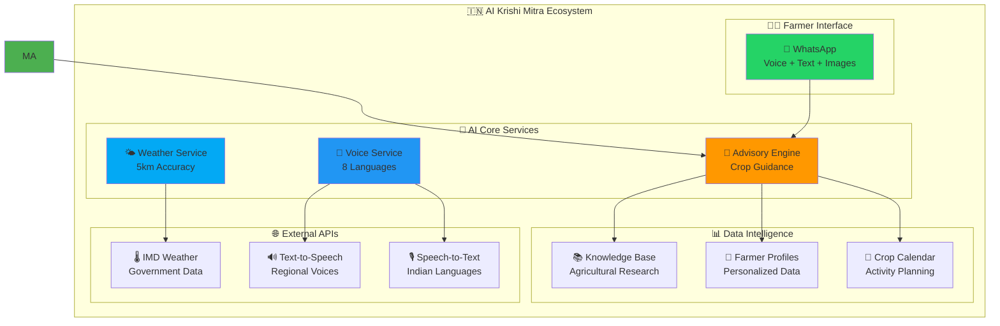

## Feature Categories

### 🎯 Core Agricultural Features

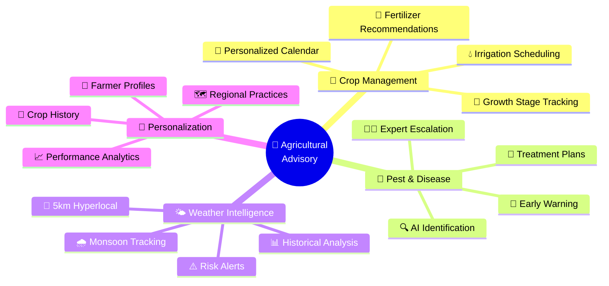

### 🗣️ Voice & Language Features

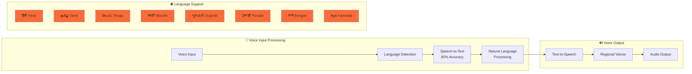

### 📱 Platform & Accessibility Features

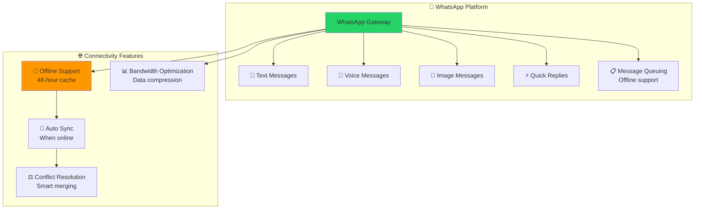

### 🌤️ Weather Intelligence System

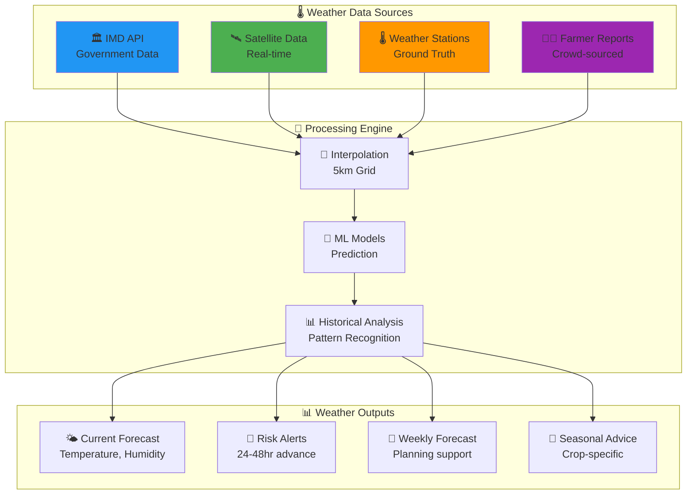

### 🚨 Risk Management & Emergency Response

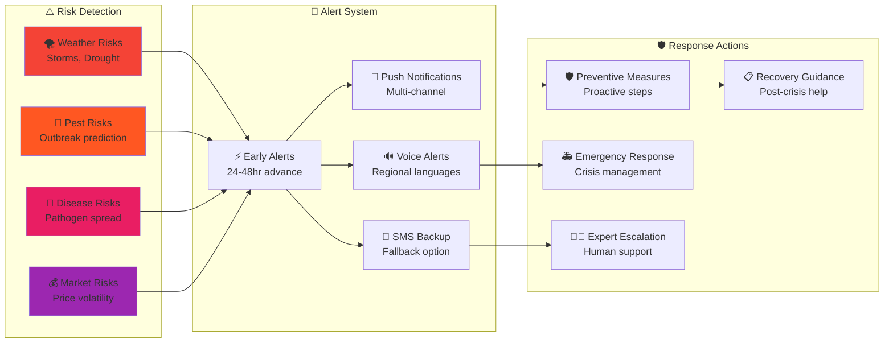

### 👨‍🌾 Farmer Journey & User Experience

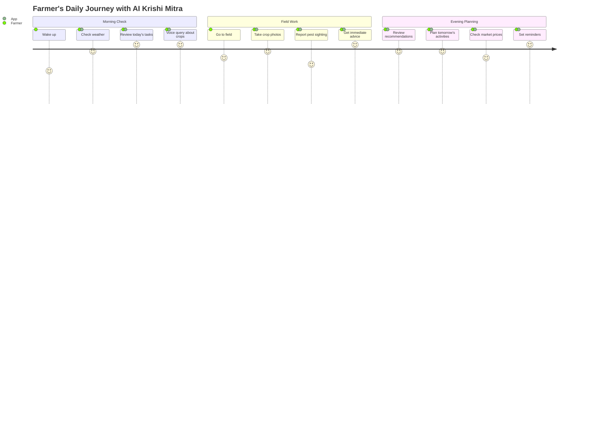

### 📊 Data Flow & Intelligence

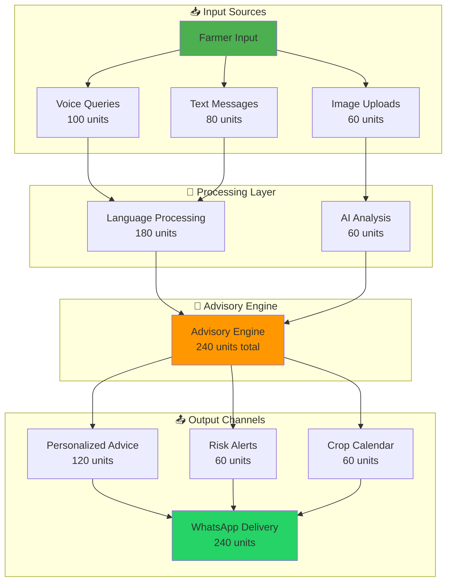

### 🎯 Feature Impact Matrix

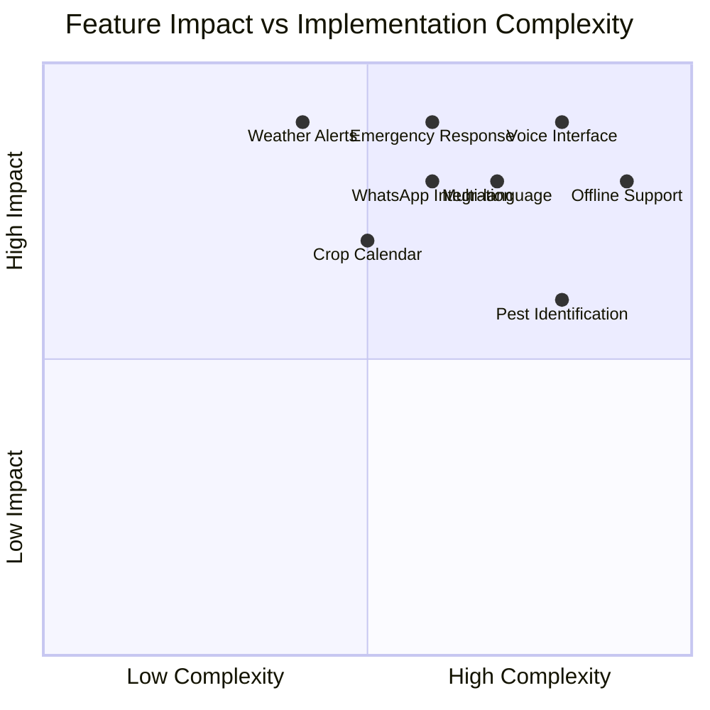

## Technical Architecture Visualization

### 🏗️ Microservices Architecture

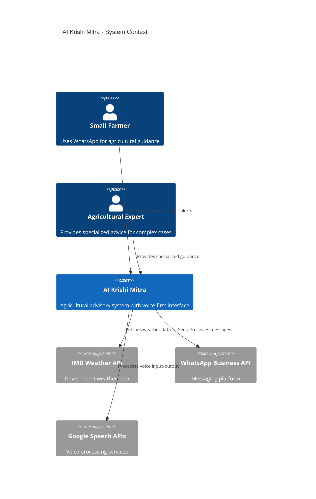

## Success Metrics Dashboard

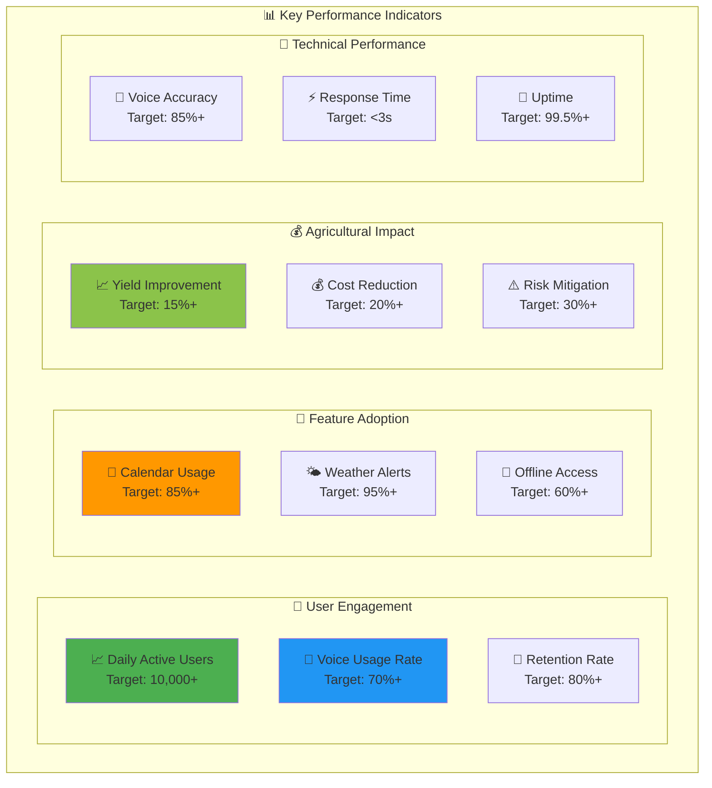

---

## 🎯 Feature Highlights Summary

### 🌟 **Unique Value Propositions**

1. **🎤 Voice-First Design**: Native support for 8 Indian languages with 85% accuracy
2. **📴 Offline-First Architecture**: 48-hour offline capability with smart sync
3. **📍 Hyperlocal Intelligence**: 5km weather accuracy with regional customization
4. **💬 WhatsApp Integration**: Familiar interface for rural users
5. **🤖 AI-Powered Advisory**: Personalized recommendations based on farmer profiles
6. **🚨 Proactive Risk Management**: 24-48 hour advance warnings
7. **👨‍🌾 Farmer-Centric Design**: Optimized for low-end devices and limited literacy
8. **🌾 Comprehensive Coverage**: End-to-end crop lifecycle management

### 📱 **Platform Accessibility**
- **WhatsApp**: Text, voice, and image message support with offline queuing
- **Low-bandwidth**: Optimized for 2G/3G networks
- **Universal compatibility**: Works on any WhatsApp-capable device

This visual presentation showcases how AI Krishi Mitra combines cutting-edge technology with deep understanding of Indian agricultural needs to create a comprehensive, accessible, and impactful solution for small and marginal farmers.