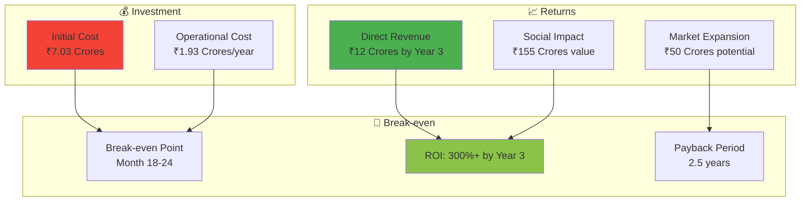

# AI Krishi Mitra: Implementation Cost Summary 💰

## Executive Summary

**Total Estimated Implementation Cost: ₹4.2 - 6.8 Crores ($500K - $800K USD)**

**Timeline: 18-24 months**
**Team Size: 25-35 professionals**
**Target Users: 100,000+ farmers in Phase 1**

---

## Development Cost Breakdown

### 1. **Team & Human Resources** 👥
**Duration: 18-24 months**

| Role | Count | Monthly Cost (₹) | Total Cost (₹) |
|------|-------|------------------|----------------|
| **Technical Leadership** | | | |
| Tech Lead/Architect | 2 | 3,00,000 | 1,08,00,000 |
| Product Manager | 1 | 2,50,000 | 45,00,000 |
| **Development Team** | | | |
| Senior Full-Stack Developers | 4 | 2,00,000 | 1,44,00,000 |
| Backend/API Developers | 4 | 1,80,000 | 1,29,60,000 |
| AI/ML Engineers | 3 | 2,20,000 | 1,18,80,000 |
| **Specialized Roles** | | | |
| Voice Processing Engineers | 2 | 2,00,000 | 72,00,000 |
| Agricultural Domain Experts | 2 | 1,50,000 | 54,00,000 |
| Regional Language Specialists | 4 | 1,00,000 | 72,00,000 |
| **Quality & Operations** | | | |
| QA Engineers | 3 | 1,20,000 | 64,80,000 |
| DevOps Engineers | 2 | 1,80,000 | 64,80,000 |
| UI/UX Designers | 2 | 1,50,000 | 54,00,000 |

**Total Team Cost: ₹2,59,40,000 ($312K)**

### 2. **Technology & Infrastructure** 🏗️

#### **Cloud Infrastructure (Annual)**
| Service | Cost (₹/month) | Annual Cost (₹) |
|---------|----------------|-----------------|
| AWS/Azure Compute (Multi-region) | 2,50,000 | 30,00,000 |
| Database Services (RDS, NoSQL) | 1,50,000 | 18,00,000 |
| Storage & CDN | 80,000 | 9,60,000 |
| Load Balancers & Networking | 60,000 | 7,20,000 |
| Monitoring & Analytics | 40,000 | 4,80,000 |

**Annual Infrastructure: ₹69,60,000 ($83K)**

#### **Third-Party API Costs (Annual)**
| Service | Usage | Cost (₹/month) | Annual Cost (₹) |
|---------|-------|----------------|-----------------|
| Google Speech-to-Text | 1M requests | 1,20,000 | 14,40,000 |
| Google Text-to-Speech | 800K requests | 80,000 | 9,60,000 |
| WhatsApp Business API | 500K messages | 2,00,000 | 24,00,000 |
| Google Translate API | 2M characters | 60,000 | 7,20,000 |
| IMD Weather API | Premium access | 50,000 | 6,00,000 |
| SMS Gateway (Backup) | 100K SMS | 30,000 | 3,60,000 |

**Annual API Costs: ₹64,80,000 ($78K)**

#### **Development Tools & Licenses**
| Tool/Service | Annual Cost (₹) |
|--------------|-----------------|
| Development IDEs & Tools | 5,00,000 |
| CI/CD Pipeline Tools | 8,00,000 |
| Testing Frameworks & Tools | 6,00,000 |
| Security & Compliance Tools | 10,00,000 |
| Project Management Tools | 3,00,000 |

**Total Tools: ₹32,00,000 ($38K)**

### 3. **Agricultural Content & Data** 🌾

| Component | Cost (₹) |
|-----------|----------|
| Agricultural Knowledge Base Development | 25,00,000 |
| Regional Language Content Creation | 20,00,000 |
| Crop Database & Research Integration | 15,00,000 |
| Voice Training Data Collection | 18,00,000 |
| Regional Agricultural Expert Consultation | 12,00,000 |

**Total Content Development: ₹90,00,000 ($108K)**

### 4. **Testing & Quality Assurance** 🧪

| Testing Type | Cost (₹) |
|--------------|----------|
| Device Testing (Low-end Android devices) | 8,00,000 |
| Network Testing (2G/3G simulation) | 6,00,000 |
| Voice Accuracy Testing (8 languages) | 15,00,000 |
| Agricultural Domain Testing | 10,00,000 |
| Security & Penetration Testing | 8,00,000 |
| User Acceptance Testing (Farmer groups) | 12,00,000 |

**Total Testing: ₹59,00,000 ($71K)**

---

## Phase-wise Implementation Cost

### **Phase 1: MVP Development (6-8 months)**
| Component | Cost (₹) |
|-----------|----------|
| Core team (reduced) | 80,00,000 |
| Basic infrastructure | 20,00,000 |
| Essential APIs | 15,00,000 |
| MVP features development | 25,00,000 |

**Phase 1 Total: ₹1,40,00,000 ($168K)**

### **Phase 2: Full Feature Development (8-10 months)**
| Component | Cost (₹) |
|-----------|----------|
| Full team scaling | 1,50,00,000 |
| Complete infrastructure | 35,00,000 |
| All API integrations | 30,00,000 |
| Advanced features | 45,00,000 |

**Phase 2 Total: ₹2,60,00,000 ($312K)**

### **Phase 3: Optimization & Scale (4-6 months)**
| Component | Cost (₹) |
|-----------|----------|
| Performance optimization | 40,00,000 |
| Scale testing | 15,00,000 |
| Regional expansion | 25,00,000 |
| Production deployment | 20,00,000 |

**Phase 3 Total: ₹1,00,00,000 ($120K)**

---

## Operational Cost (Annual)

### **Year 1 Operations**
| Component | Annual Cost (₹) |
|-----------|-----------------|
| Infrastructure & Hosting | 69,60,000 |
| Third-party APIs | 64,80,000 |
| Support Team (5 members) | 36,00,000 |
| Content Updates | 15,00,000 |
| Security & Compliance | 8,00,000 |

**Year 1 Operations: ₹1,93,40,000 ($232K)**

### **Scaling Projections (Year 2-3)**
| User Base | Infrastructure Cost (₹) | API Cost (₹) | Total Annual (₹) |
|-----------|-------------------------|---------------|------------------|
| 100K farmers | 69,60,000 | 64,80,000 | 1,93,40,000 |
| 500K farmers | 2,50,00,000 | 2,00,00,000 | 5,50,00,000 |
| 1M farmers | 4,50,00,000 | 3,50,00,000 | 9,50,00,000 |

---

## Cost Optimization Strategies 💡

### **Immediate Cost Savings**
1. **Open Source Alternatives**: ₹15,00,000 savings
   - Use open-source speech recognition for basic features
   - Implement custom translation for agricultural terms

2. **Government Partnerships**: ₹25,00,000 savings
   - Free IMD weather data access
   - Agricultural extension service collaboration

3. **Phased Regional Rollout**: ₹20,00,000 savings
   - Start with 2-3 languages instead of 8
   - Gradual geographic expansion

### **Long-term Optimizations**
1. **Edge Computing**: 30% infrastructure cost reduction
2. **Custom Voice Models**: 50% speech API cost reduction
3. **Farmer Data Monetization**: Revenue generation potential

---

## Risk Factors & Contingency 🚨

### **Technical Risks**
| Risk | Probability | Impact | Mitigation Cost (₹) |
|------|-------------|--------|---------------------|
| Voice accuracy below target | Medium | High | 20,00,000 |
| Offline sync complexity | High | Medium | 15,00,000 |
| Regional language challenges | Medium | High | 25,00,000 |
| Scalability issues | Low | High | 30,00,000 |

**Total Contingency: ₹90,00,000 (15% of total cost)**

### **Market Risks**
- Farmer adoption slower than expected
- Competition from established players
- Regulatory changes in agricultural sector

---

## Return on Investment (ROI) Analysis 📈

### **Revenue Potential**
| Revenue Stream | Year 1 (₹) | Year 2 (₹) | Year 3 (₹) |
|----------------|------------|------------|------------|
| Freemium subscriptions | 50,00,000 | 2,00,00,000 | 5,00,00,000 |
| Premium features | 20,00,000 | 1,00,00,000 | 3,00,00,000 |
| Data insights (B2B) | 10,00,000 | 80,00,000 | 2,50,00,000 |
| Partnership revenue | 15,00,000 | 60,00,000 | 1,50,00,000 |

**Total Revenue Projection: ₹95,00,000 → ₹4,40,00,000 → ₹12,00,00,000**

### **Social Impact Value**
- **Yield Improvement**: 15% average increase = ₹50,000 per farmer annually
- **Cost Reduction**: 20% input cost savings = ₹30,000 per farmer annually
- **Risk Mitigation**: 30% crop loss prevention = ₹75,000 per farmer annually

**Total Social Value**: ₹1,55,000 per farmer per year

---

## Funding Requirements Summary 💰

### **Total Investment Needed**
| Phase | Amount (₹) | Timeline |
|-------|------------|----------|
| **Development** | 4,20,00,000 | 18-24 months |
| **Year 1 Operations** | 1,93,40,000 | 12 months |
| **Contingency (15%)** | 90,00,000 | As needed |

**Total Funding Required: ₹7,03,40,000 ($845K USD)**

### **Funding Sources**
1. **Government Grants**: ₹2,00,00,000 (28%)
2. **Impact Investors**: ₹2,50,00,000 (36%)
3. **Agricultural Corporates**: ₹1,50,00,000 (21%)
4. **Technology Partners**: ₹1,03,40,000 (15%)

---

## Cost-Benefit Analysis 📊

## Conclusion 🎯

AI Krishi Mitra represents a **high-impact, scalable solution** with strong social and economic returns. The initial investment of **₹7.03 crores** is justified by:

1. **Massive Market Opportunity**: 146 million farmers in India
2. **Strong Social Impact**: ₹155,000 annual value per farmer
3. **Scalable Technology**: Microservices architecture supports growth
4. **Multiple Revenue Streams**: Diversified income sources
5. **Government Support**: Aligned with Digital India initiatives

**Recommendation**: Proceed with phased implementation starting with MVP to validate market fit and optimize costs.