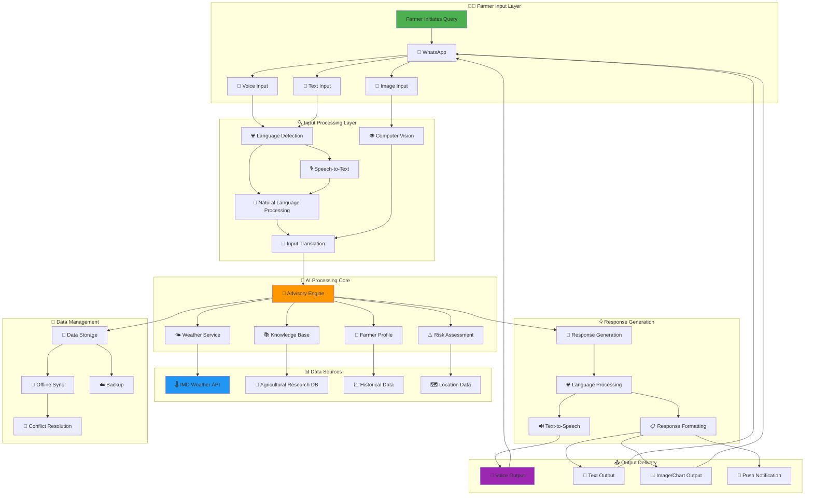
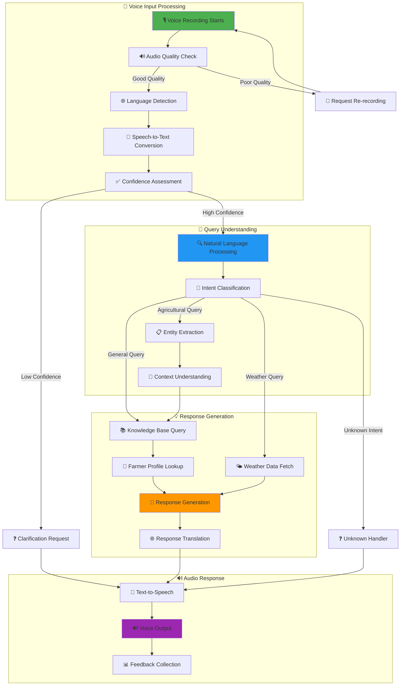
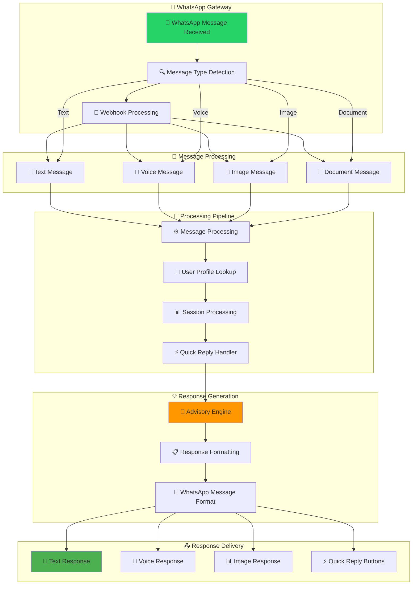
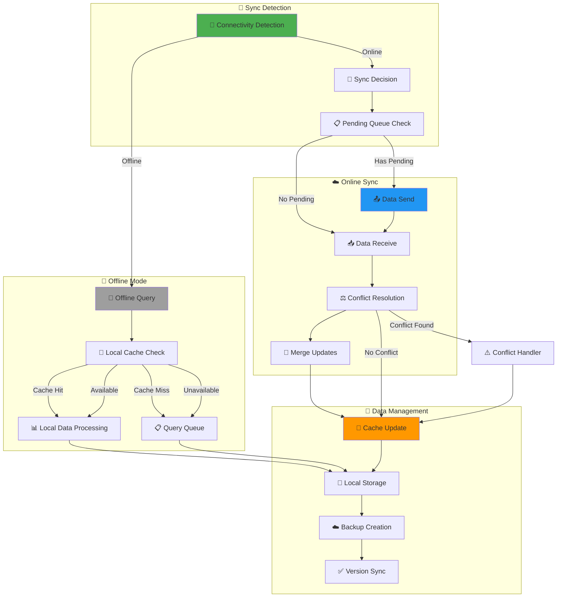
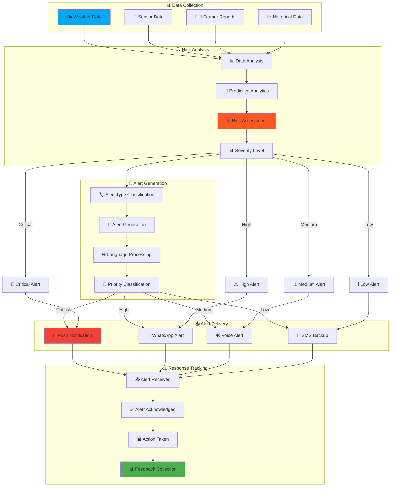
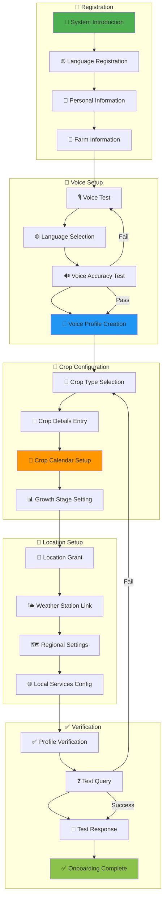
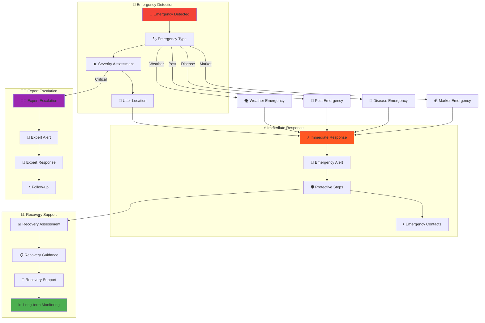

# AI Krishi Mitra: Process Flow Diagrams 🌾

## Complete System Process Flow

## Voice Query Process Flow

## WhatsApp Integration Process Flow

## Offline-Online Synchronization Flow

## Risk Alert Process Flow

## Farmer Onboarding Process Flow

## Emergency Response Process Flow

---

## Process Flow Summary

These process flows demonstrate how AI Krishi Mitra handles:

1. **Complete System Flow** - End-to-end user interaction
2. **Voice Processing** - Speech recognition and response
3. **WhatsApp Integration** - Multi-modal messaging
4. **Offline Synchronization** - Seamless online/offline transitions
5. **Risk Alerts** - Proactive warning system
6. **Farmer Onboarding** - User registration and setup
7. **Emergency Response** - Crisis management workflow

Each flow is designed to ensure reliable, accessible, and effective agricultural advisory services for India's small and marginal farmers.