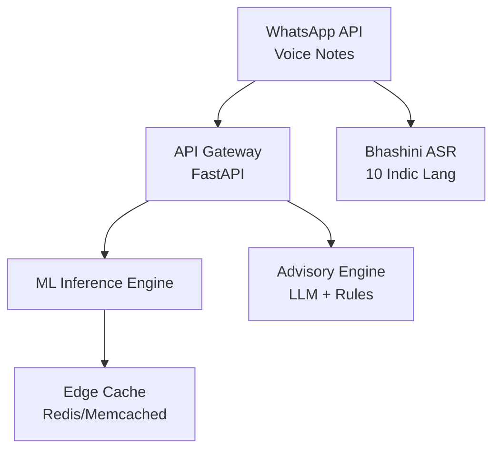

# AI Krishi Mitra - Detailed Requirements Document

## Business Requirements

### Primary Objectives

- **BR-001**: Deliver crop-specific guidance covering sowing, irrigation, fertilizer application, and integrated pest management (IPM) for 15+ major Indian crops (rice, wheat, maize, pulses, cotton, sugarcane, vegetables).
- **BR-002**: Provide hyperlocal weather forecasts (48-hour + 7-day), monsoon alerts, and climate risk notifications at mandal/tehsil granularity across 700+ districts.
- **BR-003**: Support voice-first interaction in 8 Indian languages (Hindi, Tamil, Telugu, Kannada, Malayalam, Marathi, Bengali, Punjabi) with 95%+ speech recognition accuracy.
- **BR-004**: Enable offline/low-bandwidth operation for 60%+ of rural India with <2G connectivity.
- **BR-005**: Achieve 25%+ yield improvement and 20%+ input cost reduction for active users within 12 months.

### Target Users

- **Primary**: Small and marginal farmers (≤2 hectares) - 118 million households
- **Secondary**: Farmer Producer Organizations (FPOs), Krishi Vigyan Kendras (KVKs), agri-extension workers
- **Digital Literacy**: Basic phone usage, limited smartphone penetration (35% rural), WhatsApp familiarity (52% rural smartphone users)

### Success Metrics

| KPI | Target | Measurement |
| :-- | :-- | :-- |
| Monthly Active Farmers | 100K in Year 1 | WhatsApp Business API metrics |
| Advisory Utilization | 4+ sessions/farmer/month | Voice call/session analytics |
| Yield Improvement | 21-28% validated gain | Pre/post-harvest surveys |
| Retention Rate | 65% at 6 months | Cohort analysis |
| Language Coverage | 92% of farming population | Regional adoption rates |

## Functional Requirements

### FR-100: Voice Interaction System

- **FR-101**: Support WhatsApp voice note input (30-120 seconds) with automatic transcription in regional languages using Bhashini ASR.
- **FR-102**: Real-time voice response (<3 seconds latency) via WhatsApp voice messages using Bhashini TTS.
- **FR-103**: Multi-turn conversational flow with context retention (30-minute session memory).
- **FR-104**: Fallback to text input/output for 4G users with missed call triggers (e.g., *1 for weather, *2 for pests).

### FR-200: Crop Advisory Engine

- **FR-201**: Provide stage-specific guidance across 8 crop growth phases (land prep → harvest).
- **FR-202**: Generate personalized recommendations based on:
    - Crop type and variety (150+ varieties)
    - Growth stage (days after sowing + phenology markers)
    - Soil type (12 classifications)
    - Farm size (0.5-5 acres)
    - Previous season performance
- **FR-203**: Include explainability: "Apply 25kg DAP because soil tests show P deficiency + 35th day growth stage requires root development."

### FR-300: Disease \& Pest Management

- **FR-301**: Support image-based disease identification via WhatsApp photo upload (90%+ accuracy for 50+ common diseases).
- **FR-302**: Generate IPM recommendations prioritizing bio-agents (80% preference) over chemicals.
- **FR-303**: Issue early warning alerts 7-10 days before outbreak based on weather + surveillance data.

### FR-400: Weather \& Risk Integration

- **FR-401**: Deliver hyperlocal forecasts (5km radius) integrating IMD, NASA GPM, and farmer-reported data.
- **FR-402**: Automated risk alerts for:
    - Heavy rainfall (>50mm/24hr)
    - Heat waves (>40°C consecutive 3 days)
    - Frost warnings (<5°C)
    - Cyclones (within 100km radius)
- **FR-403**: Irrigation advisories using CROPWAT methodology + soil moisture proxies.

### FR-500: Offline Mode

- **FR-501**: Cache last 7 days of personalized advisories for offline playback.
- **FR-502**: Downloadable audio guides (5-15 minutes) for major operations.
- **FR-503**: Background sync when connectivity returns (<10KB per sync).

## Non-Functional Requirements

### NFR-100: Performance

- **NFR-101**: Voice response latency <3 seconds (95th percentile) on 2G networks.
- **NFR-102**: Support 10K concurrent voice sessions with 99.5% uptime.
- **NFR-103**: Edge ML inference <500ms on mid-range Android devices.

### NFR-200: Scalability

- **NFR-201**: Handle 1M monthly active users with auto-scaling infrastructure.
- **NFR-202**: Process 50K images/day for disease detection.
- **NFR-203**: Support SMS fallback for 15% of interactions during peak usage.

### NFR-300: Accessibility

- **NFR-301**: 95%+ ASR accuracy across Indian accents and dialects.
- **NFR-302**: Offline speech synthesis with <100MB storage footprint.
- **NFR-303**: Simple 4-button IVR fallback for feature phones.

### NFR-400: Security \& Privacy

- **NFR-401**: End-to-end encryption for voice/audio data (WhatsApp Business API).
- **NFR-402**: Anonymized farmer data storage (no PII linkage).
- **NFR-403**: Compliant with DPDP Act 2023 and IT Rules 2021.

## Technical Requirements

### TR-100: Frontend

- **TR-101**: WhatsApp Business API (Cloud/On-premise) with voice note processing.
- **TR-102**: Optional Android app (React Native) for image capture + offline mode.
- **TR-103**: Missed call service via Twilio/ExeRTL for feature phone users.

### TR-200: Backend Architecture

**TR-201**: Microservices architecture (Kubernetes) with:

- Voice Processing Service (ASR → NLU)
- Advisory Engine (ML models + rules)
- Data Fusion Service (weather + markets)
- Notification Service (alerts + reminders)

### TR-300: ML Pipeline

| Component | Model | Framework | Accuracy Target |
| :-- | :-- | :-- | :-- |
| Disease Detection | EfficientNet | TensorFlow Lite | 92% Top-1 |
| Yield Prediction | XGBoost + LSTM | PyTorch | R² > 0.82 |
| Irrigation Opt | Rule-based + RL | Custom | 15% water savings |
| Vernacular NLU | Bhashini + Fine-tuned Llama | ONNX | 88% Intent accuracy |

### TR-400: Data Sources

**Real-time APIs**:

- IMD GRIB2 weather (0.25° resolution)
- AGMARKNET mandi prices (200+ commodities)
- FAO satellite NDVI (10m GSD)
- ICAR pest surveillance bulletins

**Static Datasets**:

- NBSS\&LUP soil maps (1:50K scale)
- ICAR crop calendars (district-wise)
- State agri dept variety recommendations

## Integration Requirements

### IR-100: External Systems

- **IR-101**: Bhashini APIs (ASR, NLU, TTS) - 99.9% uptime SLA required.
- **IR-102**: WhatsApp Business API - Cloud hosting with 10K TPS capacity.
- **IR-103**: IMD RWFC (Regional Weather Forecasting Centres) GRIB2 feeds.
- **IR-104**: e-NAM APIs for real-time mandi intelligence.

### IR-200: Government Schemes

- **IR-201**: PMKSY (Pradhan Mantri Krishi Sinchayee Yojana) integration for micro-irrigation subsidies.
- **IR-202**: KCC (Kisan Credit Card) linkage for input purchase recommendations.
- **IR-203**: PMFBY (Pradhan Mantri Fasal Bima Yojana) premium calculators.

## User Stories

### Priority 1 (MVP - 3 months)

- **US-001**: As a rice farmer, I want to receive sowing date recommendations based on my district's monsoon onset so I can plant at optimal time.
- **US-002**: As a cotton farmer, I want voice alerts when leaf curl disease risk increases due to weather patterns so I can spray preventively.
- **US-003**: As a smallholder with 2G, I want offline access to fertilizer application schedules so I don't need daily internet.

### Priority 2 (Phase 2 - 6 months)

- **US-004**: As a chilli farmer, I want to send leaf photos via WhatsApp and get disease diagnosis + organic treatment in Telugu.
- **US-005**: As a wheat farmer, I want market price alerts when MSP + 10% threshold reached in nearby mandis.

## Acceptance Criteria

### MVP Launch (Month 3)

- [ ] 4 major crops (rice, wheat, cotton, pulses) across 10 states
- [ ] 4 languages (Hindi, Tamil, Telugu, Kannada)
- [ ] 10K beta users with 70% retention
- [ ] <3s voice response on 2G networks
- [ ] 85% farmer satisfaction (voice feedback)

